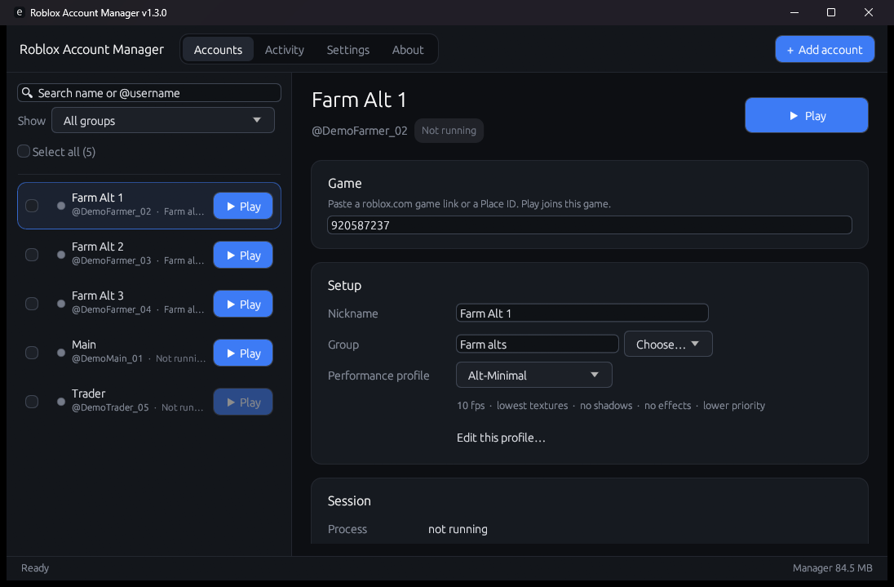
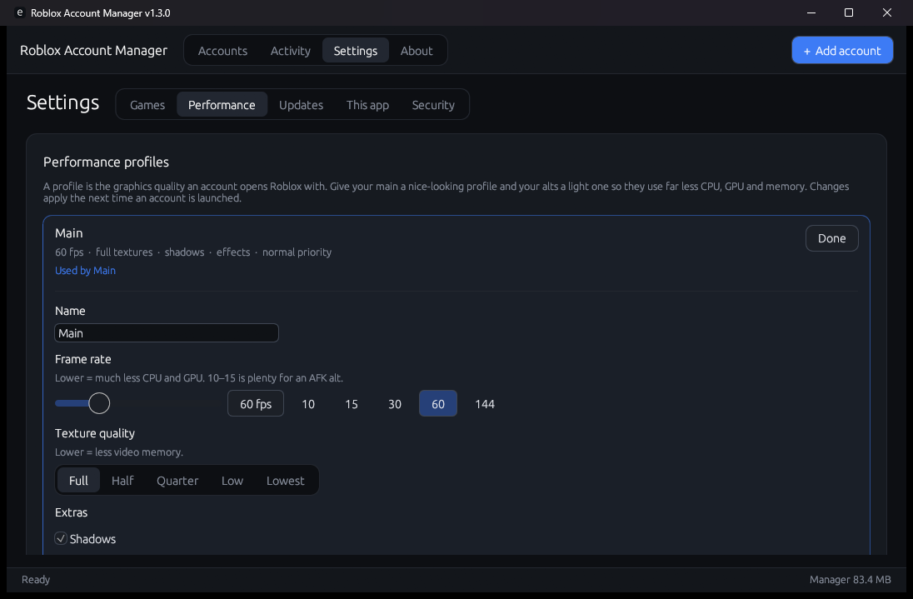
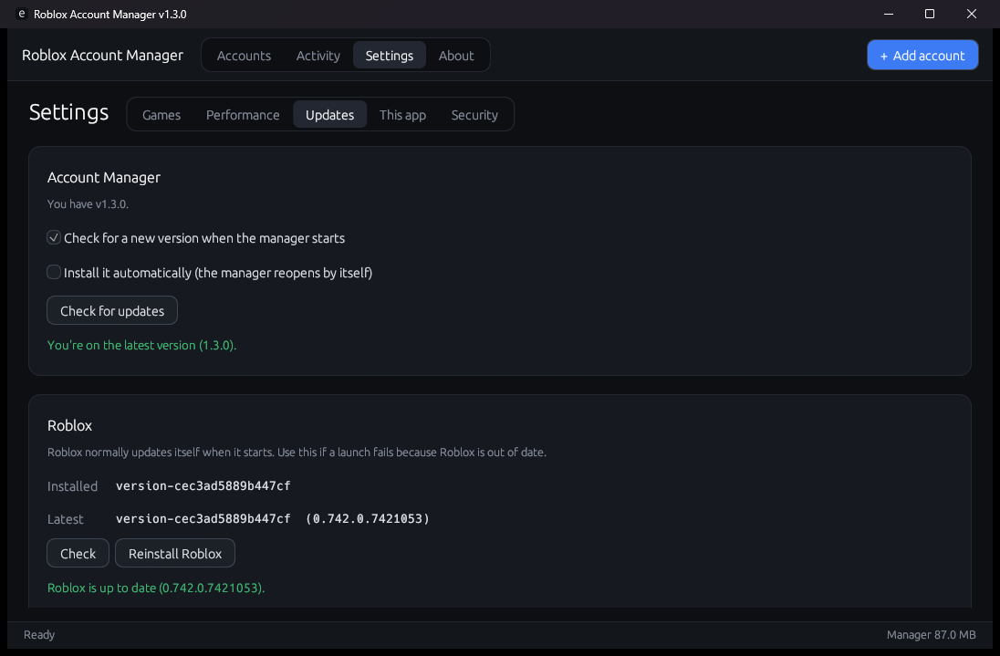
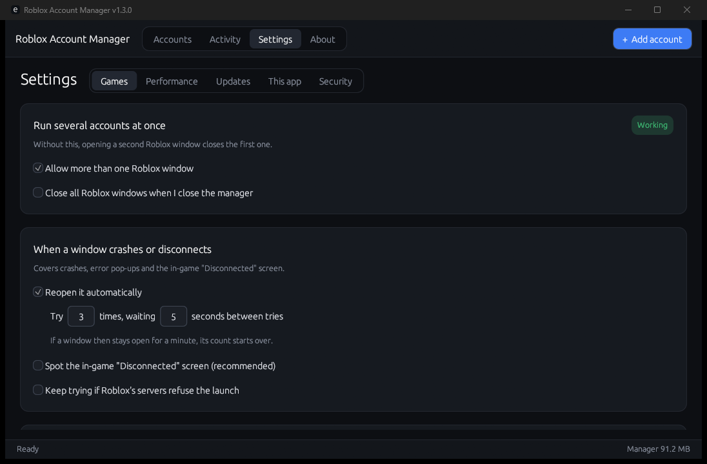

# Roblox Account Manager

**Run several Roblox accounts side by side from one small, fast Windows app.**
Sign in once, give each account a game, press Play. The manager keeps every window running, restarts the ones that crash or disconnect, and makes the windows you aren't looking at use far less memory and CPU.

---

## What it does

### 🎮 Play many accounts at once
- **One click per account, or launch a whole group.** Tick several accounts and press Launch; they open one after another, each into its own game.
- **No more "opening a second Roblox closes the first".** The manager handles Roblox's one-window limit for you, and tells you how to fix it if a Roblox window was already open before it started.
- **Find a game by name.** Type "Adopt Me" and pick it from the list, or paste any `roblox.com/games/…` link or Place ID. No game set? Play opens Roblox on its home screen (after a quick warning).
- **Groups, nicknames and search** to keep a long list of alts tidy.
- **See what everyone's doing.** Each running account shows the game it's in and for how long, e.g. *Playing Adopt Me! · 1h 05m*. *Show window* jumps to it, and every Roblox window is titled with its account name.
- **Open on start.** Mark the accounts you always run and they open by themselves when the manager starts.
- **Clean stops.** Stop ends Roblox and its helper processes completely, so nothing is left using memory.

### 🔁 Stays running without you
- **Auto-reconnect.** If a window crashes, shows an error pop-up, loses connection, gets kicked, the server shuts down, it freezes, or it never makes it into the game, it's reopened automatically. Roblox's own reason is shown in the Activity log, and you choose how many tries and how long to wait between them.
- **Rejoin the same server (best-effort).** Once verified, a reconnect can aim for the server you were in.
- **Finds Roblox windows it didn't open.** Opened Roblox from the website or before starting the manager? It recognises which of your accounts each window belongs to and starts looking after it. You don't need to close and reopen anything.
- **Survives its own restarts.** Close the manager or let it update; your games keep running and are picked up again when it reopens.

### 🪶 Light on your PC
- **Memory saver.** Trims the RAM of the Roblox windows you aren't playing in, down to a target you choose (around 100 MB per window is realistic for alts on a light profile). Levels go from *Balanced* to a *Max* hard limit.
- **CPU saver.** Puts background windows into Windows *Efficiency mode* at lower priority, or limits them to 2 CPU cores.
- **The window you're playing in gets full speed back within a second** of clicking into it. You can also choose to apply the savers to every window.
- **Performance profiles.** Give your main a nice-looking profile and your alts a light one (frame-rate cap, low graphics quality, low textures, no anti-aliasing or grass, muted) so they need a fraction of the CPU, GPU and memory. Profiles use the settings Roblox actually accepts, and your own Roblox settings are left as they were.
- **One window per account.** A second window for an account that's already playing is closed straight away, so the one you had keeps going.
- **The manager itself barely registers.** When minimized it stops drawing completely (0% GPU) and drops to a few MB of RAM.

### 🔄 Always up to date
- **Updates itself.** When a new version is out, an update window pops up. One click downloads it, and the manager closes and reopens on the new version by itself. Your games stay open.
- **Updates Roblox too.** See your installed Roblox version next to the latest one, and update it with one button using Roblox's official installer.

### 🧭 Easy to understand
- Every setting is explained in a sentence, grouped into tabs: **Games, Performance, Updates, This app, Security**.
- An **Activity** log tells you in plain words what happened and when: launched, reconnected, found running game, updated.
- Each running account shows its live memory use right in the list.

---

## Your sign-ins stay yours

- You sign in on the **real roblox.com page** in its own window. The manager never sees or stores your password.
- What it keeps is the sign-in session, **encrypted with Windows (DPAPI) for your Windows user only**. The saved data can't be opened on another PC or by another Windows user.
- The sign-in window runs as a separate, short-lived process that hands the session back over a private, unnamed channel and then exits.
- Nothing is sent anywhere except to Roblox itself (to sign in and launch games) and to this project's GitHub releases (to check for updates).
- You can export an encrypted backup or sign every account out from **Settings > Security**.

---

## Good to know

- **Windows only.** Built for Windows 10 and 11.
- **Roblox changes things.** The multi-window and log-reading features depend on how Roblox behaves today. If an update breaks something, the Activity log says what went wrong and a fix will follow.
- **Recognising windows it didn't open** works once that window has joined a game, because that's when Roblox writes which account is playing.
- **The memory saver moves memory, it doesn't make it disappear.** Trimmed memory is freed for other programs; a window that needs it again takes it back, which can cause a short hitch.
- **Same-server rejoin is best-effort.** If the server is full or has closed, Roblox puts you in another one.

---

## What's new

See the full [changelog](CHANGES.md), which is also shown in the app under **About**.

---

*This is an independent, fan-made tool. It isn't affiliated with, endorsed by or supported by Roblox Corporation. Use it in line with Roblox's Terms of Use.*
